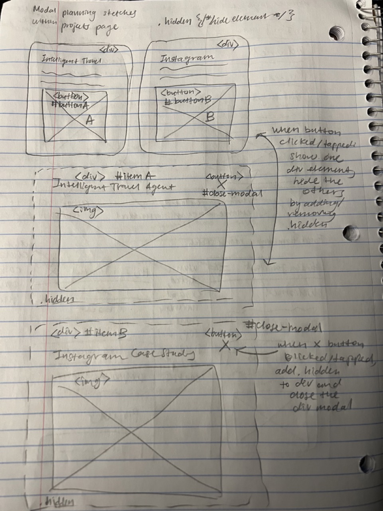

# Project 3: Design Journey

**For each milestone, complete only the sections that are labeled with that milestone.** Refine all sections before the final submission.

You are graded on your design process. If you later need to update your plan, **do not delete the original plan, leave it in place and append your new plan _below_ the original.** Then explain why you are changing your plan. Any time you update your plan, you're documenting your design process!

**Replace ALL _TODOs_ with your work.** (There should be no TODOs in the final submission.)

Be clear and concise in your writing. Bullets points are encouraged.

Place all design journey images inside the "design-plan" folder and then link them in Markdown so that they are visible in Markdown Preview.

**Everything, including images, must be visible in _Markdown: Open Preview_.** If it's not visible in the Markdown preview, then we can't grade it. We also can't give you partial credit either. **Please make sure your design journey should is easy to read for the grader;** in Markdown preview the question _and_ answer should have a blank line between them.


## Existing Project (Milestone 1)

**Tell us about the project you'll be using for Project 3.**

### Project (Milestone 1)
> Which project will you add interactivity to enhance the site's functionality?

Project 1


### Audience (Milestone 1)
> Briefly explain your site's audience. (1-2 sentences)
> Be specific and justify why this audience is a **cohesive** group.

My site's cohesive audience is job recruiters and hiring managers seeking students to hire for internships. This is a cohesive group as viewers of my website seek to discover my project experiences, skills, and career goals.


### Audience's Goals (Milestone 1)
> List the audience's goals that you identified in Project 1 or 2.
> Simply list each goal. No need to include the "Design Ideas and Choices", etc.
> You may adjust the goals if necessary.

- view my portfolio of projects and understand my skillsets
- get to know a little bit about me and my personality outside of academics and extracurriculars
- be able to reach out to me and get into contact about potential hiring roles and offers


## Interactivity Design (Milestone 1)

### Modal Interactivity Brainstorm (Milestone 1)
> Using the audience goals you identified, brainstorm possible options for **modal** interactivity to enhance the functionality of the site while also assisting the audience with their goals.
> Briefly explain each idea and provide a brief rationale for how the interactivity enhances the site's functionality for the audience. (1 sentence)
> Note: You may find it easier to sketch for brainstorming. That's fine too. Do whatever you need to do to explore your ideas.

- The modal may appear when clicking photographs of crochet and paintings to enlarge them in my hobbies page to contribute to my audience's view of my well roundedness through dedication to hobbies.
- The modal may appear when clicking figures of my project overviews to place more details about or expand on each personal project in the homepage to contribute to my audience's understanding of my application of skillsets towards my projects.
- The modal may replace the contact me information section to display my contact information when a contact me header is clicked as this places emphasis for my audience to contact me when viewing my website and porfolio.


### Interactivity Design Ideation (Milestone 1)
> Explore the possible design solutions for the interactivity.
> Sketch at least two iterations of the modal and at least two iterations of the hamburger menu interactivity.
> Annotate each sketch explaining what happens when a user takes an action. (e.g. When user clicks this, something else appears.)

Modal first iteration


Modal second iteration


Modal third iteration


Hamburger menu first iteration


Hamburger menu second iteration


Hamburger menu third iteration


### Final Interactivity Design Sketches (Milestone 1)
> Create _polished_ sketch(es) (it's still a sketch, but with a little more care taken to communicate ideas clearly to the graders) to plan your interactivity.
> **Sketch out the entire page where your interactivity will go.**
> Include your interactivity to the sketch(es).
> Add annotations to explain what happens when the user takes an action.
> Include as many sketches as necessary to communicate your design (ask yourself, could another 1300 take these sketches an implement my design?)

**Modal design sketches:**

Final modal sketch wide layout


Final modal sketch narrow layout


**Hamburger drop-down navigation menu design sketches:**


### Interactivity Rationale (Milestone 1)
> Describe the purpose of your proposed interactivity.
> Provide a brief rationale explaining how your proposed interactivity addresses the goals of your site's audience.
> This should be about a paragraph. (2-4 sentences)

The purpose of the modal is to allow my audience to view the figures pertaining my project portolio amid limited capacity. The modal allows an expanded view of my projects' final looks, which serves the purpose of allowing recruiters and hiring managers to look closer at my works. The purpose of the hamburger menu interaction is to condense the navigation bar and take up less screen space in the narrow view of my website. This addresses my audience's goals of viewing the main content of my website and ensures their focus on the most important content on the homepage.


## Interactivity Implementation Plan (Milestone 1)

### Interactivity Planning Sketches (Milestone 1)
> Produce planning sketches that include all the details another 1300 student would need to implement your interactivity design.
> Your planning sketches should include _all_ HTML elements needed for the interactivity; _annotations_ for the element types, their unique IDs, and CSS classes; and lastly the initial CSS classes.

**Modal planning sketches:**



**Hamburger drop-down navigation menu planning sketches:**


### Interactivity Pseudocode Plan (Milestone 1)
> Write your interactivity pseudocode plan here.
> Pseudocode is not JavaScript. Do not put JavaScript code here.

**Modal pseudocode:**

Open the modal:

```
.hidden {
    display: none
}

when #buttonA is clicked (event):
    remove .hidden from #itemA

when #buttonB is clicked (event):
    remove .hidden from #itemB

```

Close the modal:

```
when #close-modal-A is clicked (event):
    add .hidden to #itemA

when #close-modal-B is clicked (event):
    add .hidden to #itemB
```

**Hamburger menu pseudocode:**

Pseudocode to show/hide (toggle) the navigation menu (narrow screens):

```
when #hamburger-button is clicked (event):
    remove .hidden from #navigation-menu-stacked

when #close-burger is clicked (event):
    add .hidden to #navigation-menu-stacked

```

Pseudocode to hide the hamburger button and show the navigation bar when the window is resized too wide:

```
when window-width > 600px (event):
    add .hidden to #hamburger-button
    remove .hidden from #navigation-menu-row
```

Pseudocode to show the hamburger button and hide the navigation menu when the window is resized too narrow:

```
when window-width < 600px (event):
    remove .hidden from #hamburger-button
    add .hidden to #navigation-menu-row
```


## Grading (Final Submission)

### Interactivity Usability Justification (Final Submission)
> Explain how your design effectively uses affordances, visibility, feedback, and familiarity.
> Write a paragraph (3-5 sentences)

The modals for my projects homepage effectively uses affordances and visibility through changing the cursor to a pointer when the mouse hovers over each respective project image. Upon opening the modal, the visible close button in the right corner of the modal indicates the user may close the modal, and there is an immediate feedback when the modal is opened and closed. The hamburger menu button that is visible when the screen width is narrower indicates the user may interact with it to expand the navigation menu into a stacked menu. When the hamburger button is clicked/toggled, the menu shows/hides, allowing the user to recieve immediate feedback. The modal is a common design pattern for expanding an image and a hamburger menu is a common design pattern for showing/hiding navigation on narrow screens.


### Tell Us What to Grade (Final Submission)
> We aren't re-grading your Project 1 or 2.
> We are only grading the interactivity you added.
> Tell us where (what pages) we can find your interactivity and how to use it.
> **We will only grade what you list here;** if it's not listed, we won't grade it.

I added modal interactivity to the images on the Projects page, or the index HTML file. When an image from a project is clicked, a modal pops up with the title of the project and an expanded view of the project image. This functionality is only present in wide views of the website. I added hamburger menu button interactivity to each page of my website, and it is only present in narrow views of the website. When clicked, the hamburger menu button toggles the stacked navigation menu open and close. When minimizing the width of the window size, the navigation bar disappears and the hamburger menu button appears. When expanding the window size to a wide view, the hamburger button disappears as their is enough space for a full navigation bar. After clicking the hamburger menu button to expand the navigation menu, navigating to a different page from the current one will not collapse the stacked menu. The stacked menu will collapse upon either clicking the menu button again or expanding the window size.


### Collaborators (Final Submission)
> List any persons you collaborated with on this project.

None.


### Reference Resources (Final Submission)
> Please cite any external resources you referenced in the creation of your project.
> (i.e. W3Schools, StackOverflow, Mozilla, etc.)

### Self-Reflection (Final Submission)
> This was the first project in this class where you coded some JavaScript. What did you learn from this experience?

I learned the iterative process of designing, planning, and coding JavaScript. From the initial steps of creating planning sketches on paper, to writing pseudocode snippets, and finally following the snippets and adding additional functions with JavaScript, I implemented interactivity for my website to the best of my knowledge and ability. I learned how to properly go through the debugging process and utilize the resource document of snippets for the modal and hamburger menu button. I was also able to carefully implement my designs and plans through following design patterns of affordances, visibility, feedback, and familiarity.


> Take some time here to reflect on how much you've learned since you started this class. It's often easy to ignore our own progress. Take a moment and think about your accomplishments in this class. Hopefully you'll recognize that you've accomplished a lot and that you should be very proud of those accomplishments!

At this point in the class, I have learned a lot about creating websites that maintain a vision for their intended audience through planning and designing for accessibility and client-side interactivity. When I first coded the non-interactive version of this project's website, I did not yet learn many elements of framing my website for a wide window or utilizing flex-boxes to arrange content effectively. Currently, I have improved upon my website to further my progression to create a polished website to use as a personal website and portfolio. I am proud of the progress I have made with this project and my skills learned from this class.
